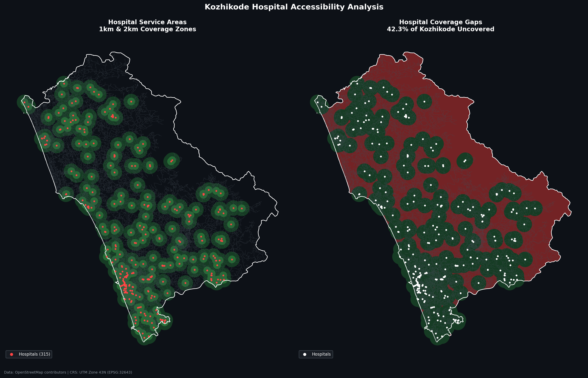

# Kozhikode Hospital Accessibility Analysis



## Problem
42.3% of Kozhikode (1,088 km²) has no hospital within 2km. This analysis maps exactly where those gaps are.

## Live Interactive Map
[Click to explore](https://sreehariksureshh.github.io/kozhikode-accessibility-analysis/)

## Key Findings
- Total city area: 2,349 km²
- Covered within 2km of hospital: 1,356 km² (57.7%)
- Uncovered: 1,089 km² (42.3%)
- Hospitals mapped: 315 | Schools: 648 | Banks: 356

## Tools Used
Python, GeoPandas, OSMnx, Folium, Matplotlib

## Data Source
OpenStreetMap contributors

## How to Run
```bash
git clone https://github.com/sreehariksureshh/kozhikode-accessibility-analysis.git
conda activate gis
pip install geopandas osmnx folium geodatasets
jupyter notebook notebooks/kozhkode.ipynb
```

## Author
Sreehari K Suresh — MSc Data Analytics & Geoinformatics  
Kozhikode, Kerala, India